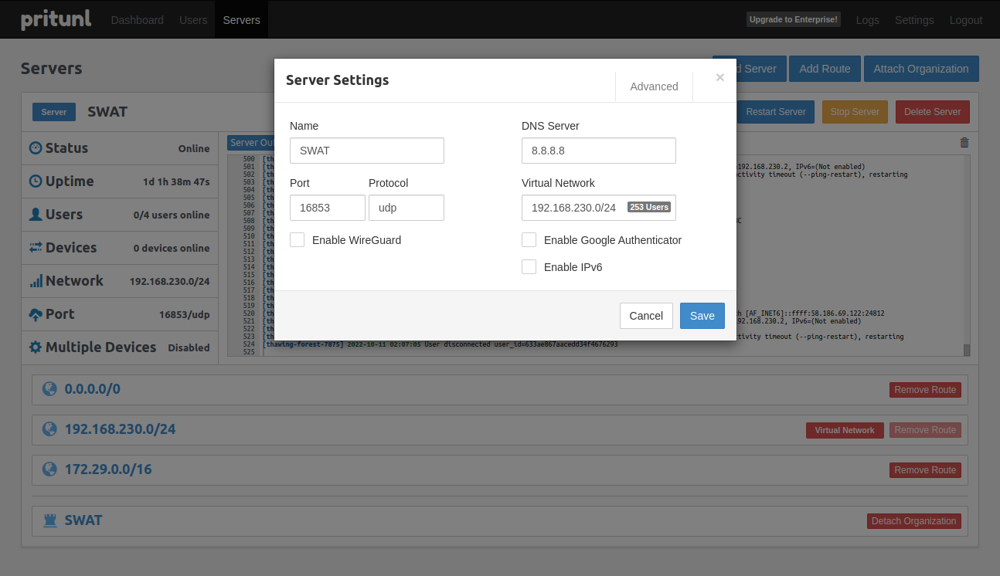
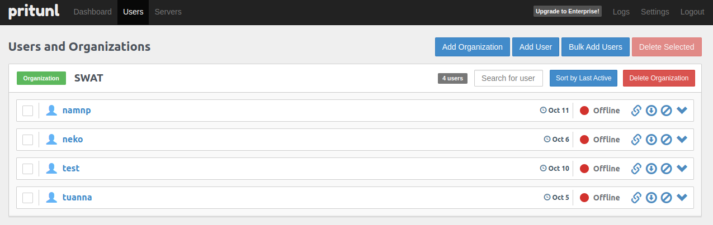
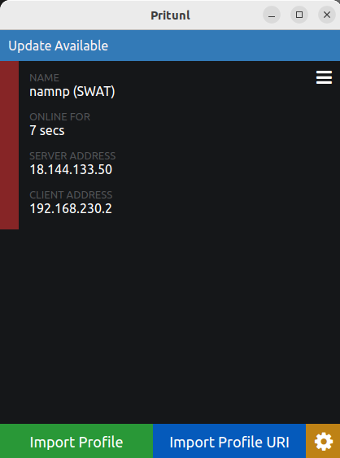

# Setup Pritunl VPN

```bash
# ssh to vpn instance
## get pritunl setup key
pritunl setup-key
## open browser and go to https://<vpn_public_ip>:80
## enter setup key
## go back to terminal
pritunl default-password
## enter password and default username on browser
## Setup VPN
```

### NOTE: After apply VPN module, you can use terraform for apply all resources

### Configure

- Access `${pritunl_public_ip}` in your browser
- SSH to Pritunl server
- Run command
    ```sh
        $ sudo pritunl setup-key
    ```
- Copy code and Enter Setup Key
- Run command
    ```sh
        $ sudo pritunl default-password
    ```
- Use username and password for login
- Change to new password

### Create user profile

- Add organization
- Add user to organization
- Add server
- Add route

  NOTE:

  If you want to access to other server, you need to add route to that server
  Example: DNS server to resolve dns of private zone in VPC (172.60.0.0/16)

  => DNS server: 172.60.0.2, 8.8.8.8, 8.8.4.4

  DNS server separated by comma. The DNS server list is used:
  - `172.60.0.2`: DNS server in VPC for private zone
  - `8.8.8.8`: DNS server in public network (Google DNS) for resolve public domain
  - `8.8.4.4`: Other DNS server in public network (Google DNS) for resolve public domain. Added because sometime `8.8.8.8` is not enough for resolve public domain (from cloudflare, ...)

  

- Download user profile

  

### Import user profile

- Install Pritunl Client or OpenVPN Client
- Import user profile
- Connect VPN

  Example using Pritunl Client

  
